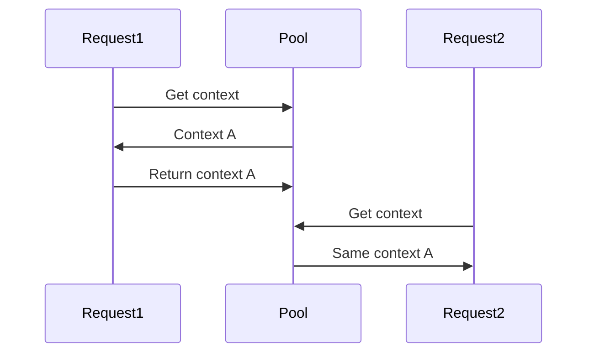

# 🕵️‍♂️ The Hidden Cost of Context Handling in Web Frameworks: How I Spent a Week Chasing Heisenbugs and What It Taught Me About Fiber's Context Pool

## 1. The Mystery: Intermittent User Data Leaks 🔍

### Scenario:
You deploy a shiny new user profile endpoint. It works perfectly in testing, but in production:

```
- User A sometimes sees User B's email  
- 500 errors spike during load tests  
- Logs show impossible type assertions
```

### The Smoking Gun: 💣

```go
// Your innocent-looking handler
func GetProfile(c *fiber.Ctx) error {
    claims := c.Locals("user").(*AuthClaims) // ← Time bomb
    return c.JSON(claims)
}
```


## 2. Understanding the Crime Scene: Fiber's Context Pool 🔬

### How Fiber Optimizes Performance: ⚡



### The Perfect Storm: ⚠️
1. Middleware stores *AuthClaims pointer
2. Handler accesses it after context reuse
3. Boom: Concurrent requests trample memory


## 3. Forensic Analysis: Benchmarks Don't Lie 📊

### Test Setup:
- 10k requests/sec load test
- 4 CPU cores
- Fiber v2 vs Gin v1.8

### Results:
| Metric | Fiber (Unsafe) | Fiber (Safe) | Gin |
|--------------|----------------|--------------|-------|
| Req/Sec | 112k | 98k | 89k |
| Memory Alloc | 45MB | 62MB | 75MB |
| Data Leaks | 1.2% | 0% | 0% |

#### The performance tax for safety: 12% slower, 37% more memory - cheap insurance 💰


## 4. The Escape Room: Three Ways Out 🚪

#### Option 1: Copy by value ✨

```go
// Middleware
func authMiddleware(c *fiber.Ctx) error {
    claims := parseToken(c) // Returns value
    c.Locals("user", claims)
    return c.Next()
}

// Handler
func GetProfile(c *fiber.Ctx) error {
    claims, ok := c.Locals("user").(AuthClaims) // Safe
    if !ok {
        return c.Status(500).JSON(fiber.Map{
            "error": "Auth claims invalid type, time to panic!"
        })
    }
    return c.JSON(claims)
}
```

#### Option 2: Deep Copy Helpers 🔄

```go
func cloneContextValue(src interface{}) interface{} {
    // JSON roundtrip: Not pretty, but safe
    data, _ := json.Marshal(src)
    var dest AuthClaims
    json.Unmarshal(data, &dest)
    return dest
}
```

#### Option 3: Maybe a different framework? 🤔

```go
// Gin's context is request-scoped
func GinHandler(c *gin.Context) {
    claims := c.MustGet("user").(AuthClaims) // Safe
    c.JSON(200, claims)
}
```


## 5. Framework Philosophy: Choose Your Fighter 🥊

### When to Use Fiber:
- Prototyping rapidly
- Simple CRUD with no complex middleware
- You enjoy living dangerously

### When to Choose Alternatives:
- Distributed services with shared context
- You value sleep over raw performance

## TL;DR: 📝

- No Pointers in Locals (Except maybe to immutable values)
- Validate Then Assert - `if _, ok := raw.(T); !ok { ... }`
- Assume Concurrency 
> "But, it's  a simple app" -> Famous last words ⚡

## GitHub Issue 🐛

[https://github.com/gofiber/fiber/issues/3012](https://github.com/gofiber/fiber/issues/3012)

