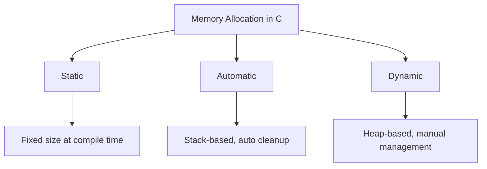
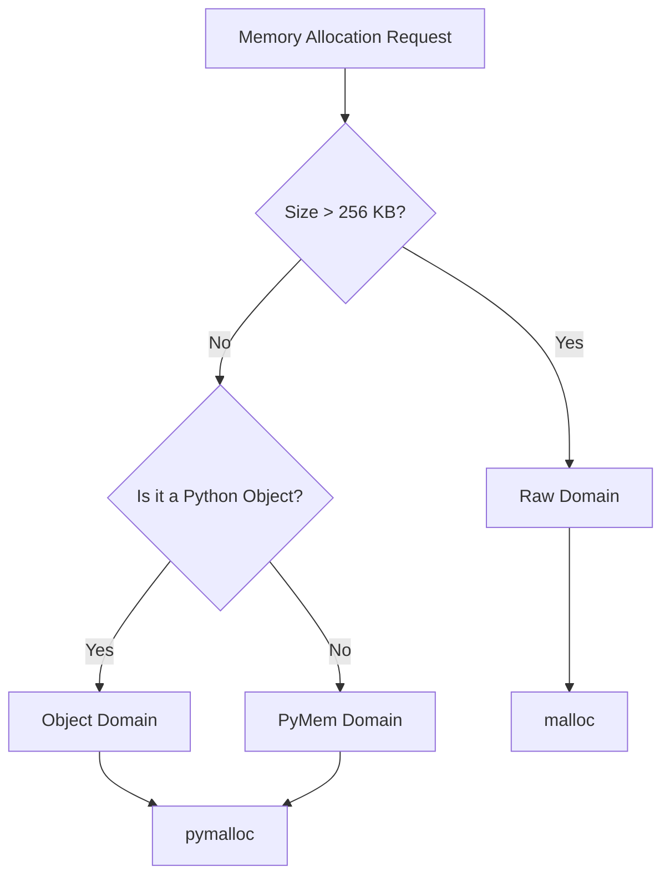
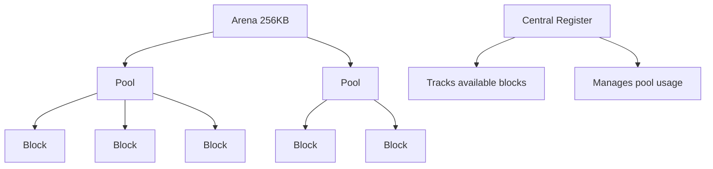
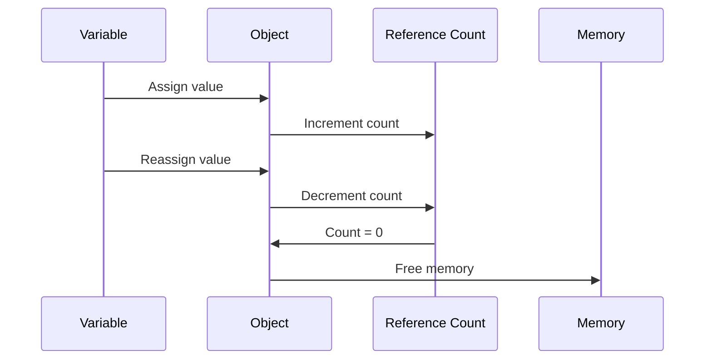
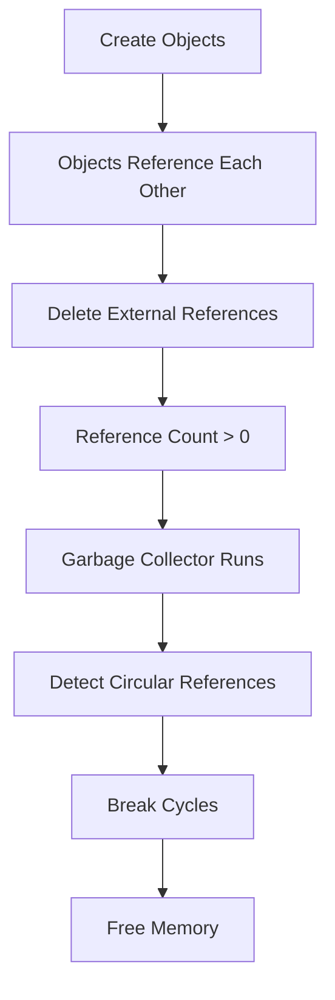
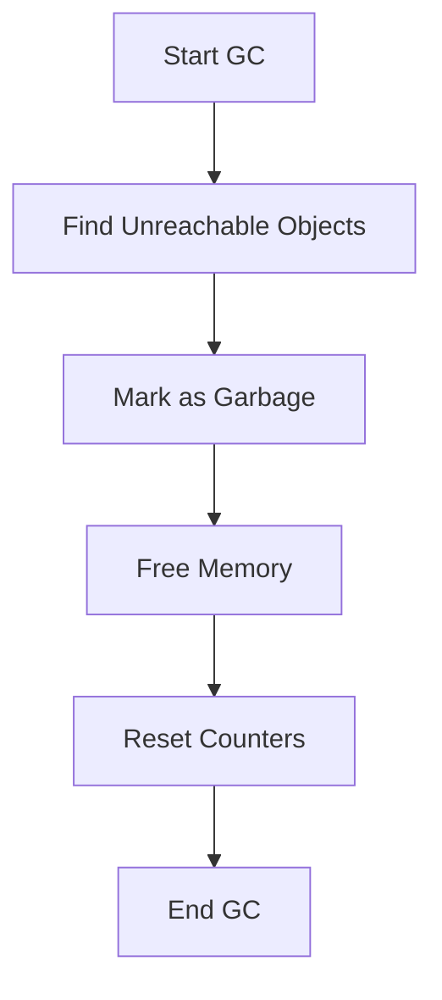
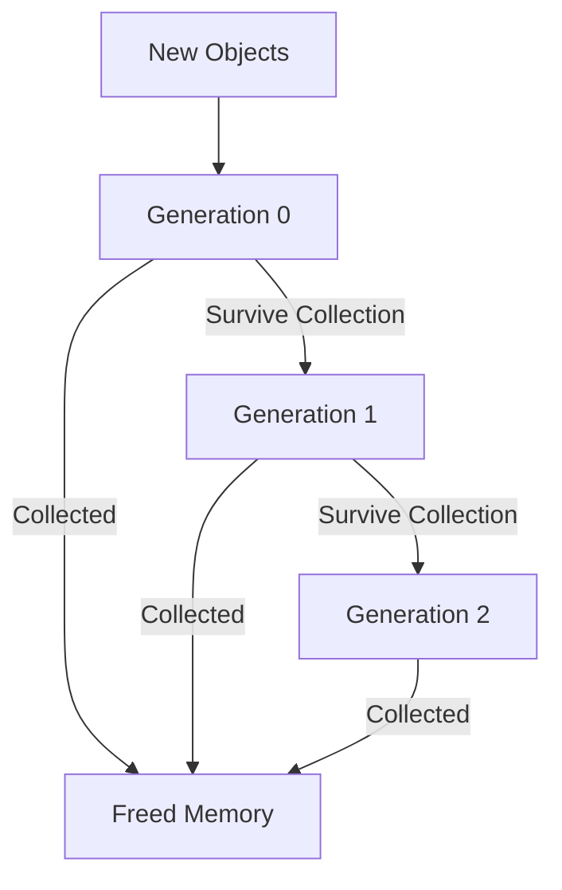

Sure, keep blaming the language like the rest of the herd — But if your code’s leaky and crawling, Spoiler: it’s you, not the language😏

Ah, another day, another developer blaming Python for their code's sluggish performance. 🐌 Before you join the chorus of the uninformed, let's embark on a journey through the labyrinthine world of Python's memory management.

## The Architect's Dilemma: Designing a Programming Language

Ever fantasized about creating your own programming language? Imagine having the power to decide how memory management works. Sounds thrilling, right? Or maybe just terrifying. It’s not just about keeping things simple or making them complex. Nope, it’s a constant tug-of-war between:

- Keeping interfaces idiot-proof
- Making sure it works on everything
- Balancing speed with not crashing all the time

The brains behind Python have done most of the heavy lifting for you, so you don’t have to think too hard. But they’ve also left some decisions in the hands of the average coder. The real question is: how many even know what choices they're making? And of those, how many are actually getting it right? Welcome to the can of worms you just opened.

## Peering Under the Hood: CPython's Memory Allocation

Time to roll up our sleeves and check out what’s under CPython’s hood. Curious how memory allocation works in C’s engine room? Meet the trio running the show:

1. **Static memory allocation**: The old-school, rock-solid type.
2. **Automatic memory allocation**: The reliable workhorse, always on duty.
3. **Dynamic memory allocation**: The nimble gymnast, ready to adapt on the fly.



CPython, built on C's rigid foundation, has its own set of hurdles. But things get interesting when Python’s design philosophy starts throwing wrenches into the mix:

- **Dynamically typed**: Size? Who cares? We’ll figure it out when we get there.
- **Dynamically sized core types**: Lists, dictionaries, even integers – none of them have any clue about limits.
- **Names as shape-shifters**: `some_value` could be anything – an integer, a string, or even a list. It’s like Python’s version of a wild card.

To manage this circus, CPython relies heavily on dynamic memory allocation. But don’t worry, it’s not as reckless as it sounds. Python added some fancy safety nets: garbage collection and reference counting. It’s like Python decided to handle the boring memory stuff for you. How thoughtful. (is this thanked enough, though?)

```python
# Example of dynamic typing and its impact on memory
x = 5  # Initially an integer
print(f"x is an integer: {x}, Size: {x.__sizeof__()} bytes")

x = "Hello"  # Now a string
print(f"x is now a string: {x}, Size: {x.__sizeof__()} bytes")

x = [1, 2, 3]  # Now a list
print(f"x is now a list: {x}, Size: {x.__sizeof__()} bytes")
```

## The Triad of Allocation Domains

Check out the three realms of memory allocation, each with its own gig:

1. **The Raw Domain**: For when you want to dive straight into system heap and manage big, non-object-related memory. Not for the faint-hearted.
2. **The Object Domain**: Where Python objects hang out, blissfully ignorant of the underlying mess.
3. **The PyMem Domain**: A throwback for those still using legacy APIs and penning letters by candlelight.

CPython uses two types of allocators:

- **`malloc`**: The OS's basic tool for raw memory.
- **`pymalloc`**: Python’s custom allocator, designed for the PyMem and Object domains.

CPython's memory allocator, perched on top of `malloc` like a picky bird, has its own quirks:

- Most requests are small and fixed-size. PyObject? Just 16 bytes. PyASCIIObject? A lean 42 bytes. PyLongObject? A hefty 32 bytes.
- `pymalloc` handles blocks up to 256 KB. Larger chunks? They’re sent to `malloc`.
- Thread safety? Not needed with the GIL in play. `pymalloc` is like, “I’m good!”



## The Holy Trinity: Blocks, Pools, and Arenas



Blocks, the basic memory units, gather in pools. Pools are then grouped into arenas. It’s a bureaucratic dance of efficiency that would make any office manager proud.

A central register, like a know-it-all librarian, keeps track of block locations and availability within each pool. When a pool runs out of space, the next one in line picks up the slack.

### Arenas: The Grand Ballrooms of Memory

Arenas, the big shots of memory grouping, are a hefty 256KB to match the system page size. Why? Because contiguous memory is faster than fragmented memory. It’s a nice theory, but how many developers actually care? I’m not counting on it.

Arenas are strung together in a doubly linked list within the arena data structure, using `nextarena` and `prevarena` pointers. It’s like a conga line of memory—minus the fun and dancing.

### Pools: The Social Clubs of Memory Blocks

Inside an arena, pools are created for block sizes up to 512 bytes, like a just-in-time memory buffet. If no pools are available for a requested size, a new one is added. Arenas keep track of pool creation with a high water mark.

Pools come in three types: Full, Used, and Empty. It’s like a memory nightclub—some are packed, some have space, and some are just waiting for action.

Each pool has a doubly linked list to other pools of its class, like a social network for memory blocks—they always know where their buddies are.

### Blocks: The Individual Dancers in the Memory Ballet

In a pool, memory is chopped up into fixed-size blocks, allocated and freed with the precision of a seasoned choreographer. Available blocks are tracked in a singly linked list called `freeblock`.

When a block is freed, it’s shoved to the front of the `freeblock` list—like cutting in line, but perfectly acceptable in the realm of memory management.

## The Object and PyMem Memory Allocation Domains

The object memory allocator is the VIP lounge of the memory world, handling Python objects like dictionary keys and list items. It’s also the backstage pass for the compiler, AST, parser, and evaluation loop—where the real Python magic happens.

For those feeling rebellious and wanting to ditch the default strategy, you can create custom domain allocators or memory allocation sanitizers. But be warned: this isn’t for the faint of heart or the code-impaired. Know what you’re doing before you dive into this high-stakes game.

## Reference Counting: Your Personal Memory Butler

Now, let’s chat about reference counting—the unsung hero of Python’s memory management. It’s like having a butler who actually does their job, keeping track of your stuff and making sure it’s cleaned up properly.



Every time you create an object, Python starts counting references—no, not your coding blunders (that’d be endless), but references to the object. When you assign a value to a variable, Python checks `locals()` and `globals()`, creates a new object if needed, and updates the relevant dictionary.

In CPython’s C source code, you’ll find `Py_INCREF()` and `Py_DECREF()` macros. These are the main tools for bumping up or down the reference count. It’s like a very dull, but crucial, game of ping pong.

This example demonstrates how Python keeps track of references and adjusts the count as references are added or removed:

```python
import sys

# Create a list
a = [1, 2, 3]
print(f"Reference count for 'a': {sys.getrefcount(a)}")

# Create another reference to the same list
b = a
print(f"Reference count after 'b = a': {sys.getrefcount(a)}")

# Remove one reference
del b
print(f"Reference count after 'del b': {sys.getrefcount(a)}")
```

## Garbage Collection: Because Some People Can't Clean Up After Themselves



But what about those pesky circular references? You know, like when you do something silly like this:

```python
x = []
x.append(x)
del x
```

The reference count for `x` is still 1 because it referred to itself. It's like a snake eating its own tail, but less mythological and more annoying.

Enter the garbage collector—Python’s way of saying, “Alright, I’ll handle it.” It cleans up memory from objects that have outlived their usefulness. Enabled by default, it works in the background like a spectral janitor, tidying up without making a fuss.



The garbage collector doesn’t run constantly—because that’d be a CPU nightmare. Instead, it kicks in periodically after a certain number of operations. It’s like taking out the trash: you don’t do it every five minutes, but you also don’t wait until your place is buried in garbage.

And here's a concrete example of a circular reference: This example creates a circular reference that reference counting alone can't handle, demonstrating the need for garbage collection.

```python
import gc

class Node:
    def __init__(self, name):
        self.name = name
        self.next = None

# Create a circular reference
node1 = Node("Node 1")
node2 = Node("Node 2")
node1.next = node2
node2.next = node1

# Remove references to the nodes
del node1, node2

# Force garbage collection
gc.collect()

print(f"Garbage collector collected {gc.get_count()} objects")
```

## Generational Garbage Collection: Because Even Trash Has a Lifecycle

Python’s garbage collector uses generational garbage collection, based on the idea that most objects are short-lived. Like mayflies, but for memory.

CPython’s collector has three generations, each with its own threshold for when to clean up. It’s like a trash lifecycle—starting with fresh garbage and eventually dealing with vintage refuse.



An example demonstrating generations GC:

```python
import gc

# Create some objects
a = [1, 2, 3]
b = "Hello, World!"
c = {"key": "value"}

# Check garbage collection counts
print(f"GC counts before collection: {gc.get_count()}")

# Force a collection
gc.collect()

print(f"GC counts after collection: {gc.get_count()}")

# Create more objects
for _ in range(1000):
    list(range(100))

print(f"GC counts after creating many objects: {gc.get_count()}")
```

## In Conclusion: A Mirror for the Masses

So, next time you’re tempted to complain about Python’s performance, maybe take a moment for some self-reflection. Consider what ‘side effects’ your code might be causing, which could be the real culprit.

Python has made a heroic effort to simplify memory management. If your code still runs like a sloth in molasses, sure, no tool is ever perfect, but are you using it ‘properly’? Maybe it’s time to hit the books. Just saying...🤔💻