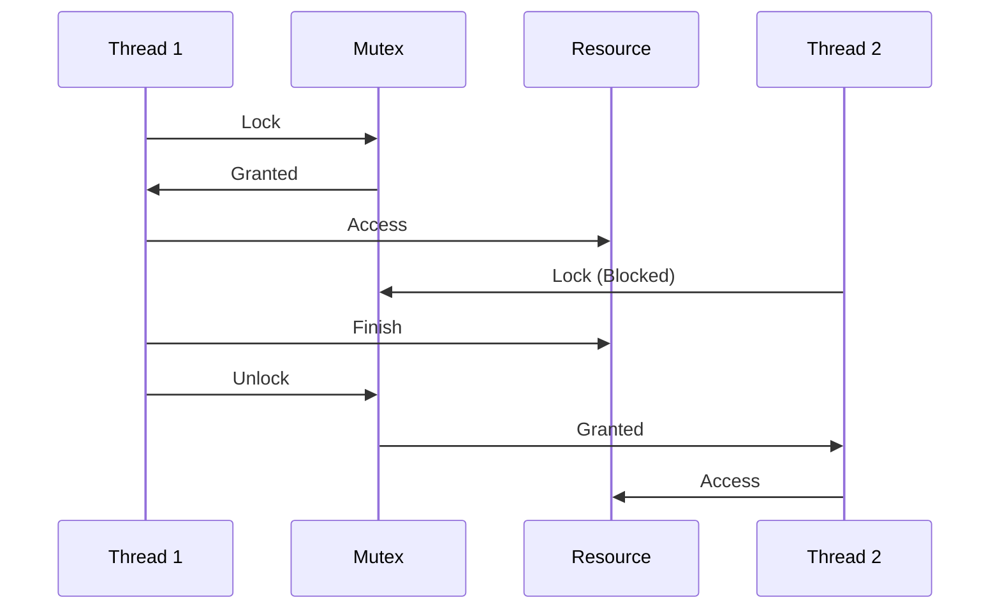
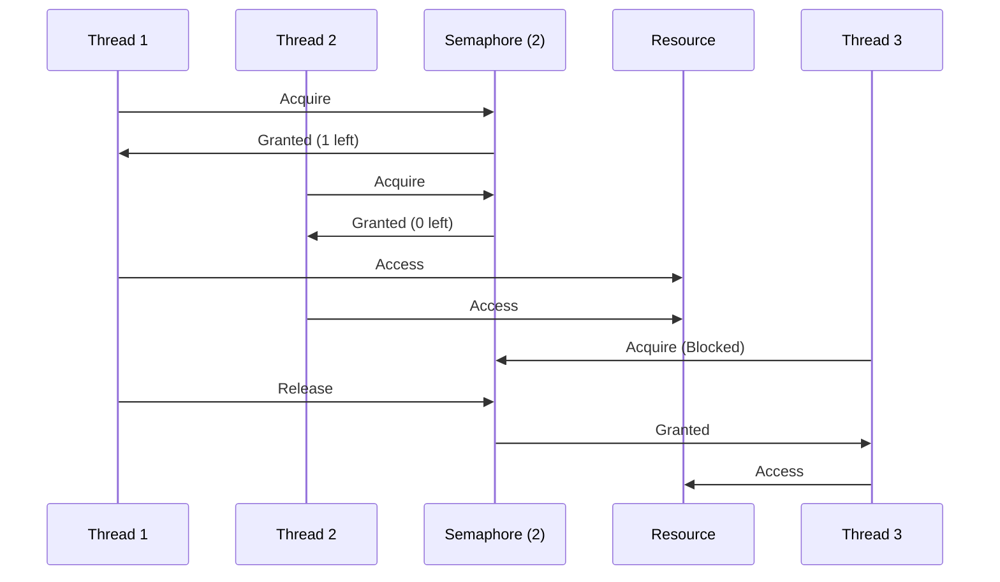
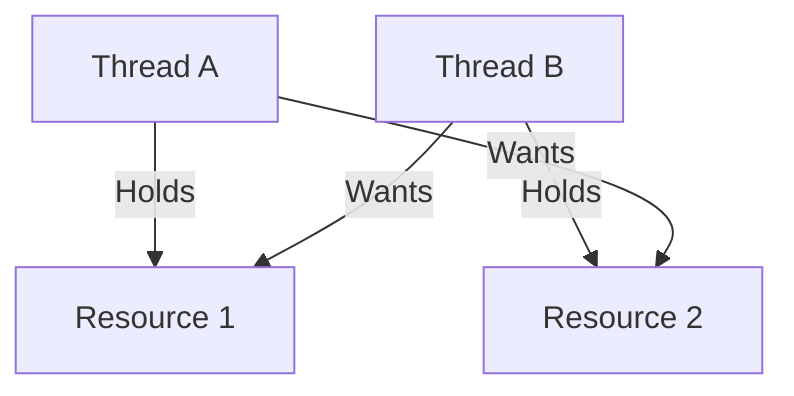

# Mutex vs Semaphore: The Lesser of Two Evils

Mutexes and semaphores are like siblings in the synchronization primitives family — one a stickler for rules (mutex), the other more lenient but equally capable of chaos when misused (semaphore). I'll try to dive into this family drama with a sprinkle of snark, to explore their strengths, weaknesses.. And, both drive me nuts when misused.

# The Boring Theory

## Mutex

A mutex, short for "mutual exclusion," is like that one friend who insists on being the only one to use their fancy pen. It's a locking mechanism that ensures only one thread can access a shared resource at a time.



## Semaphore

A semaphore, on the other hand, is a signaling mechanism. It can control access by multiple threads using a counter. When the counter is greater than zero, a thread can proceed and decrement the counter. When it hits zero, threads block until the counter is incremented.

Loosely speaking, a semaphore is like a nightclub bouncer with a clicker. It allows a specified number of threads to access a resource concurrently. When the limit is reached, newcomers have to wait until someone leaves.



# The Good, The Bad, and The Ugly

## Mutex: When One Is the Loneliest Number (And That's Good)

Use a mutex when:

 1. You have a critical section that absolutely must be executed by only one thread at a time.
 2. You need to protect shared data from race conditions.
 3. You want to ensure the atomicity of a complex operation.


 ```csharp
 using System;
using System.Threading;

public class BankAccount
{
    private decimal balance = 0;
    private readonly object lockObject = new object();

    public void Deposit(decimal amount)
    {
        lock (lockObject)
        {
            // Critical section
            balance += amount;
        }
    }

    public bool Withdraw(decimal amount)
    {
        lock (lockObject)
        {
            if (balance >= amount)
            {
                balance -= amount;
                return true;
            }
            return false;
        }
    }
}
```

## Semaphore: When You Need to Control the Party

Use a semaphore when:

1. You want to limit the number of threads that can access a resource concurrently.
2. You're implementing a producer-consumer pattern.
3. You need to synchronize access to a pool of resources.

```csharp
using System;
using System.Collections.Generic;
using System.Threading;

public class Connection
{
    // Connection implementation
}

public class ConnectionPool
{
    private readonly List<Connection> connections = new List<Connection>();
    private readonly SemaphoreSlim semaphore;

    public ConnectionPool(int maxConnections)
    {
        semaphore = new SemaphoreSlim(maxConnections, maxConnections);
        for (int i = 0; i < maxConnections; i++)
        {
            connections.Add(new Connection());
        }
    }

    public async Task<Connection> GetConnectionAsync()
    {
        await semaphore.WaitAsync();
        return connections[connections.Count - 1];
    }

    public void ReleaseConnection(Connection connection)
    {
        connections.Add(connection);
        semaphore.Release();
    }
}
```

## The Pitfalls: Where Good Intentions Go to Die

Now, let's talk about 'cases' when 'some' of us manage to royally screw things up. Buckle up, because this is where it gets painful.

### Deadlocks: The Eternal Standoff
Picture two threads, each holding a resource the other needs. They're locked in a deadly embrace, waiting for the other to blink first. This, my friends, is a deadlock.



To avoid this nightmare:

1. Always acquire locks in a consistent order.
2. Use timeouts when acquiring locks.
3. Implement deadlock detection and recovery mechanisms.


### Priority Inversion: When the VIP Gets Stuck Behind the Bouncer

Imagine a high-priority thread waiting for a low-priority thread to release a lock. Meanwhile, a medium-priority thread keeps preempting the low-priority thread. It's like a VIP stuck behind the bouncer while regular patrons keep streaming in.

To mitigate this:

1. Use priority inheritance protocols.
2. Minimize the time locks are held.
3. Consider lock-free algorithms for performance-critical sections. 
(your current and future peers will either thank you immensely or curse you out—depending on how well you understand and implement this. This is a world of dragons, fwiw.)

and, for the love of all that’s holy, please go with the simpler option!! PLEASE!

## Maybe lets switch gears?

### Read-Write Locks: The Bookworm's Paradise

When you have many readers and few writers, a read-write lock can significantly improve performance.

```csharp
using System;
using System.Threading;
using System.Threading.Tasks;

public class AsyncReadWriteLock
{
    private readonly SemaphoreSlim _readSemaphore = new SemaphoreSlim(1, 1);
    private readonly SemaphoreSlim _writeSemaphore = new SemaphoreSlim(1, 1);
    private int _readCount = 0;

    public async Task<IDisposable> ReadLockAsync(CancellationToken cancellationToken = default)
    {
        await _readSemaphore.WaitAsync(cancellationToken);
        try
        {
            if (Interlocked.Increment(ref _readCount) == 1)
            {
                await _writeSemaphore.WaitAsync(cancellationToken);
            }
        }
        finally
        {
            _readSemaphore.Release();
        }

        return new AsyncDisposable(async () =>
        {
            await _readSemaphore.WaitAsync(cancellationToken);
            try
            {
                if (Interlocked.Decrement(ref _readCount) == 0)
                {
                    _writeSemaphore.Release();
                }
            }
            finally
            {
                _readSemaphore.Release();
            }
        });
    }

    public async Task<IDisposable> WriteLockAsync(CancellationToken cancellationToken = default)
    {
        await _writeSemaphore.WaitAsync(cancellationToken);
        return new AsyncDisposable(() => Task.FromResult(_writeSemaphore.Release()));
    }

    private class AsyncDisposable : IDisposable
    {
        private readonly Func<Task> _releaseAction;
        private bool _isDisposed;

        public AsyncDisposable(Func<Task> releaseAction)
        {
            _releaseAction = releaseAction;
        }

        public void Dispose()
        {
            if (_isDisposed) return;
            _isDisposed = true;
            _releaseAction().GetAwaiter().GetResult();
        }
    }
}
```

and that could be used in a potential real-world use case like this - 

```csharp
public class ThreadSafeCache
{
    private readonly Dictionary<string, string> _cache = new Dictionary<string, string>();
    private readonly AsyncReadWriteLock _lock = new AsyncReadWriteLock();

    public async Task<string> GetOrAddAsync(string key, Func<Task<string>> valueFactory, CancellationToken cancellationToken = default)
    {
        using (await _lock.ReadLockAsync(cancellationToken))
        {
            if (_cache.TryGetValue(key, out string value))
            {
                return value;
            }
        }

        using (await _lock.WriteLockAsync(cancellationToken))
        {
            // Double-check in case another thread added the value
            if (_cache.TryGetValue(key, out string value))
            {
                return value;
            }

            string newValue = await valueFactory();
            _cache[key] = newValue;
            return newValue;
        }
    }

    public async Task UpdateAsync(string key, string value, CancellationToken cancellationToken = default)
    {
        using (await _lock.WriteLockAsync(cancellationToken))
        {
            _cache[key] = value;
        }
    }
}
```

And, a runsheet (atleast, for me) for these 'real-world' use cases:

1. Correct Lock Usage: We properly release locks using using statements, ensuring they're always released even if exceptions occur.
2. Double-Checked Locking: We first check under a read lock, then under a write lock, minimizing the time spent holding the more expensive write lock.
3. Async Operations: Both reading and writing support asynchronous operations, crucial for maintaining responsiveness in real-world applications.
4. Cancellation Support: All methods accept a CancellationToken, allowing operations to be cancelled gracefully.


### Lock-Free Algorithms: Living on the Edge

For the truly brave (or foolhardy), lock-free algorithms offer the promise of high performance without the overhead of locks. But beware, here be dragons.

```csharp
using System;
using System.Threading;

public class LockFreeStack<T>
{
    private class Node
    {
        public T Value;
        public Node Next;
        public int Version;

        public Node(T value, Node next, int version)
        {
            Value = value;
            Next = next;
            Version = version;
        }
    }

    private Node _head;
    private long _operationCount;

    public void Push(T value)
    {
        var newNode = new Node(value, null, 0);
        while (true)
        {
            var oldHead = _head;
            newNode.Next = oldHead;
            if (Interlocked.CompareExchange(ref _head, newNode, oldHead) == oldHead)
            {
                Interlocked.Increment(ref _operationCount);
                return;
            }
            Thread.Yield();
        }
    }

    public bool TryPop(out T result)
    {
        while (true)
        {
            var oldHead = _head;
            if (oldHead == null)
            {
                result = default;
                return false;
            }
            var newHead = oldHead.Next;
            if (Interlocked.CompareExchange(ref _head, newHead, oldHead) == oldHead)
            {
                result = oldHead.Value;
                Interlocked.Increment(ref _operationCount);
                // Ensure the node can't be reused until all ongoing operations that might have seen it complete
                SpinWait.SpinUntil(() => Volatile.Read(ref _operationCount) % 2 == 0);
                return true;
            }
            Thread.Yield();
        }
    }

    public long OperationCount => Volatile.Read(ref _operationCount);
}
```

And, the runsheet here (again, atleast for me):
1. ABA Problem Mitigation! 
2. Operation Counting: The `_operationCount` field keeps track of the number of push and pop operations. This can be useful for monitoring and debugging purposes.
3. Memory Ordering: Use `Volatile.Read` to ensure proper memory ordering when reading the operation count.
4. Backoff Strategy: Use `Thread.Yield()` instead of busy-waiting, which can improve performance in high-contention scenarios by allowing other threads to make progress.
5. Safe Memory Reclamation: The `SpinWait.SpinUntil` in TryPop ensures that a popped node isn't immediately reused, preventing potential issues with ongoing operations.

A potential application for lock-free algorithms? A logging system! Nothing can get busier, imho. 

```csharp
public class HighPerformanceLogger
{
    private readonly LockFreeStack<LogEntry> _logBuffer = new LockFreeStack<LogEntry>();
    private readonly Thread _logWriterThread;
    private volatile bool _isRunning = true;
    private readonly AutoResetEvent _newLogEvent = new AutoResetEvent(false);

    public HighPerformanceLogger()
    {
        _logWriterThread = new Thread(LogWriterLoop);
        _logWriterThread.Start();
    }

    public void Log(string message, LogLevel level)
    {
        _logBuffer.Push(new LogEntry(message, level, DateTime.UtcNow));
        _newLogEvent.Set();
    }

    private void LogWriterLoop()
    {
        while (_isRunning)
        {
            if (_logBuffer.TryPop(out var logEntry))
            {
                // In a real implementation, we'd write to a file or database
                Console.WriteLine($"[{logEntry.Timestamp:yyyy-MM-dd HH:mm:ss.fff}] [{logEntry.Level}] {logEntry.Message}");
            }
            else
            {
                // Wait for a new log entry or a timeout. We coulduse `sleep` instead, well.. I don't like ... sleep, in programming contenxt only though :p
                _newLogEvent.WaitOne(100);
            }
        }

        // Process any remaining logs after shutdown signal
        while (_logBuffer.TryPop(out var logEntry))
        {
            Console.WriteLine($"[{logEntry.Timestamp:yyyy-MM-dd HH:mm:ss.fff}] [{logEntry.Level}] {logEntry.Message}");
        }
    }

    public void Shutdown()
    {
        _isRunning = false;
        _newLogEvent.Set(); // Ensure the log writer thread wakes up
        _logWriterThread.Join();
        _newLogEvent.Dispose();
    }
}

public enum LogLevel
{
    Debug,
    Info,
    Warning,
    Error,
    Critical
}
```

1. Event-Based Waiting: This allows the log writer thread to efficiently wait for new log entries without consuming CPU cycles.
2. Decoupled Log Writing: The `LogWriterLoop` runs on a separate thread, processing log entries asynchronously. This ensures that logging doesn't slow down the main application threads.
3. Low-Latency: The 'lock-free' nature of our stack means that logging operations (pushes) complete very quickly, minimizing the impact on latency-sensitive operations -- like, whatever it is your company does to save the world!
4. Graceful Shutdown: The `Shutdown` method demonstrates how to safely stop the logging thread, ensuring all logs are processed before the application exits.


# So, what am I saying?

imho, here's a checklist for the discerning engineer:

 1. Know Your Tools: Understand the differences between mutexes, semaphores, and other synchronization primitives.
 2. Profile, Profile, Profile: Don't guess at performance bottlenecks. Use profiling tools to identify real issues. 
 3. Keep It Simple: Complex synchronization schemes are bug magnets. Simplify where possible. Please... KISS!
 4. Test Thoroughly: Concurrency bugs are notoriously hard to reproduce. Sometimes impossible to reproduce. So, be ready for 3am calls -- Ah, im sure it will go wrong.. Yup, very very sure... 
 5. Review and Refactor: Regularly review your concurrent code. What made sense yesterday might be a nightmare today.

...[spiderman quote playing in the background]... Use these tools wisely, and please "understand" the difference before 'trying' parallelism/threading/concurrency and may your code be ever race-condition free.


